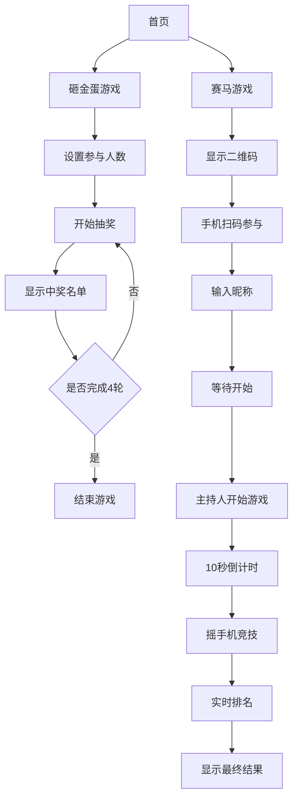

## 1. 产品概述
年会互动游戏网站，为50-60人规模的公司年会提供两个互动游戏：砸金蛋（随机抽奖）和赛马（实时竞技）。通过数字化方式提升年会趣味性和参与度。

解决传统年会游戏组织混乱、参与度低的问题，让每位员工都能参与到互动中来，增强团队凝聚力。

## 2. 核心功能

### 2.1 用户角色
| 角色 | 注册方式 | 核心权限 |
|------|----------|----------|
| 年会参与者 | 扫码参与 | 参与赛马游戏、查看个人排名 |
| 主持人/管理员 | 预设账号 | 控制游戏流程、开始抽奖、管理游戏状态 |

### 2.2 功能模块
年会网站包含以下核心页面：
1. **首页**：游戏选择入口、活动介绍、二维码展示
2. **砸金蛋页面**：抽奖控制面板、中奖名单展示
3. **赛马游戏页面**：草原场景、马匹展示、实时排行榜
4. **扫码参与页面**：移动端入口、昵称输入
5. **游戏结果页面**：最终排名、奖品信息

### 2.3 页面详情
| 页面名称 | 模块名称 | 功能描述 |
|----------|----------|----------|
| 首页 | 游戏入口区 | 显示砸金蛋和赛马两个游戏的入口按钮 |
| 首页 | 活动说明 | 展示游戏规则和参与方式 |
| 首页 | 二维码区 | 显示赛马游戏二维码供手机扫描 |
| 砸金蛋页面 | 参与人数设置 | 输入实际参与人数（50-60人） |
| 砸金蛋页面 | 抽奖控制区 | 显示当前轮次、开始抽奖按钮 |
| 砸金蛋页面 | 中奖名单 | 展示每轮15名中奖者及其序号 |
| 砸金蛋页面 | 排除设置 | 自动过滤包含数字4的序号 |
| 赛马游戏页面 | 草原场景 | 3D草原背景，显示多匹赛马 |
| 赛马游戏页面 | 马匹信息 | 每匹马显示参与者微信昵称 |
| 赛马游戏页面 | 倒计时器 | 10秒倒计时显示 |
| 赛马游戏页面 | 实时排行榜 | 动态显示马匹排名和进度 |
| 扫码参与页面 | 二维码扫描 | 手机扫码进入游戏 |
| 扫码参与页面 | 昵称输入 | 输入微信昵称用于马匹标识 |
| 扫码参与页面 | 摇一摇检测 | 检测手机摇动动作并转换成分数 |
| 游戏结果页面 | 最终排名 | 显示1-57名完整排名 |
| 游戏结果页面 | 奖品信息 | 按排名区间显示对应奖品等级 |

## 3. 核心流程

### 砸金蛋流程
主持人输入参与人数 → 系统生成有效序号池（过滤含4数字）→ 点击开始抽奖 → 系统随机抽取15人 → 显示中奖名单 → 标记已中奖人员 → 进行下一轮（共4轮）

### 赛马流程
参与者手机扫码 → 输入微信昵称 → 大屏幕上显示马匹 → 主持人点击开始 → 10秒倒计时 → 参与者摇手机加速 → 实时显示排名 → 游戏结束显示最终排名 → 按排名发放奖品

## 4. 用户界面设计

### 4.1 设计风格
- **主色调**：金色（#FFD700）和红色（#DC143C）体现年会喜庆氛围
- **辅助色**：深绿色（#228B22）用于赛马草原场景
- **按钮样式**：圆角矩形，金色渐变背景，悬停效果
- **字体**：中文使用思源黑体，数字使用Arial Bold
- **布局风格**：居中对齐，卡片式设计，重要信息突出显示
- **图标风格**：使用emoji和简洁的线性图标

### 4.2 页面设计概述
| 页面名称 | 模块名称 | UI元素 |
|----------|----------|--------|
| 首页 | 游戏入口 | 两个大按钮，金色和绿色渐变，中央放置游戏图标 |
| 砸金蛋页面 | 控制面板 | 白色卡片背景，蓝色开始按钮，中奖名单用金色高亮 |
| 赛马游戏页面 | 草原场景 | 全屏绿色渐变背景，3D草原效果，马匹用不同颜色区分 |
| 赛马游戏页面 | 排行榜 | 半透明黑色背景，金色文字显示排名和昵称 |
| 扫码参与页面 | 移动端界面 | 简洁白色背景，大字体显示游戏状态和摇一摇提示 |

### 4.3 响应式设计
- **桌面优先**：主控界面针对大屏幕优化
- **移动端适配**：扫码参与页面完全适配手机屏幕
- **触控优化**：按钮大小适合手指点击，摇一摇检测灵敏度可调

### 4.4 3D场景指导
- **环境**：广阔草原HDRI，天空盒营造开阔感
- **光照**：主光源模拟阳光，环境光填充，边缘光突出马匹
- **相机**：俯视角度45度，缓慢移动增加动感
- **构图**：前景草地，中景赛马跑道，背景远山
- **交互**：马匹根据摇一摇强度产生不同动画效果
- **性能**：限制同时渲染马匹数量，使用LOD优化