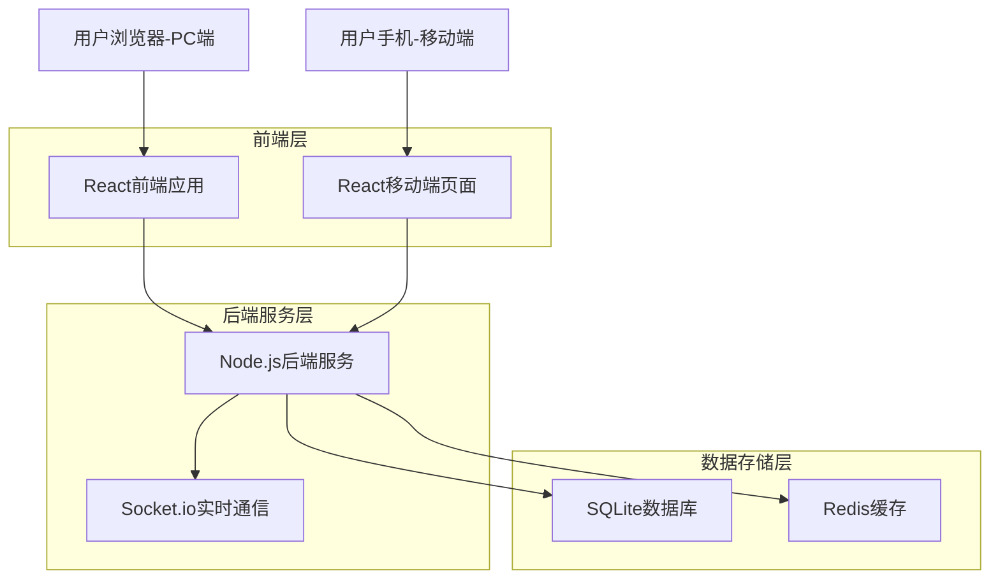
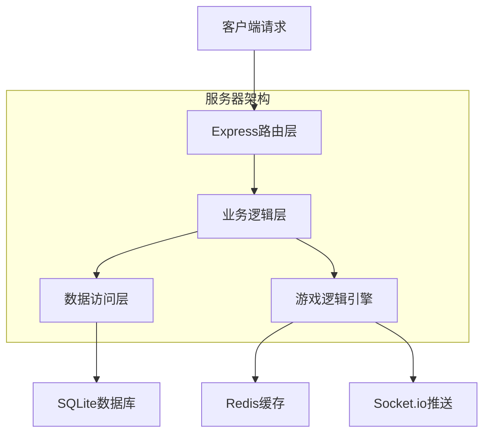
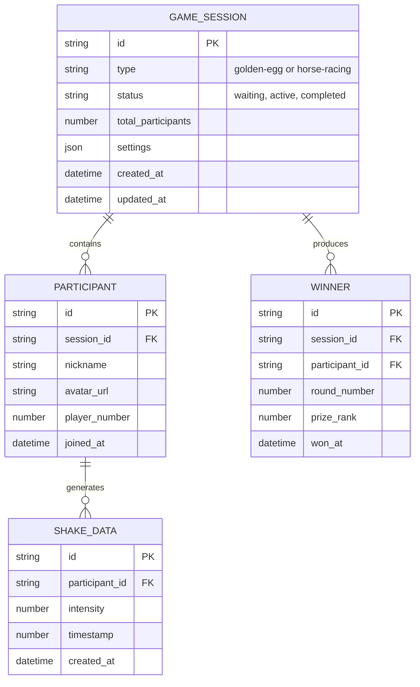

## 1. 架构设计



## 2. 技术描述

* **前端**：React\@18 + TailwindCSS\@3 + Vite

* **初始化工具**：vite-init

* **后端**：Node.js\@18 + Express\@4

* **实时通信**：Socket.io\@4

* **数据库**：SQLite3（轻量级，适合单点部署）

* **缓存**：Redis（用于实时游戏状态管理）

* **移动端适配**：React Responsive + Device Motion API

## 3. 路由定义

| 路由                | 用途        |
| ----------------- | --------- |
| /                 | 首页，游戏选择入口 |
| /golden-egg       | 砸金蛋游戏主控界面 |
| /horse-racing     | 赛马游戏大屏幕界面 |
| /join/:gameId     | 手机扫码参与页面  |
| /result/:gameType | 游戏结果展示页面  |
| /admin            | 管理员控制面板   |

## 4. API定义

### 4.1 砸金蛋游戏API

**创建游戏会话**

```
POST /api/golden-egg/create
```

请求参数：

| 参数名               | 类型     | 必需    | 描述            |
| ----------------- | ------ | ----- | ------------- |
| totalParticipants | number | true  | 参与总人数         |
| rounds            | number | false | 轮次数（默认4轮）     |
| perRoundCount     | number | false | 每轮抽取人数（默认15人） |

响应：

```json
{
  "sessionId": "game_123",
  "status": "created",
  "totalValidNumbers": 53,
  "excludedNumbers": [4, 14, 24, 34, 40, 41, 42, 43, 44, 45, 46, 47, 48, 49, 54]
}
```

**抽取中奖者**

```
POST /api/golden-egg/draw
```

响应：

```json
{
  "round": 1,
  "winners": [
    {"number": 1, "name": "员工A"},
    {"number": 2, "name": "员工B"}
  ],
  "remainingCount": 38
}
```

### 4.2 赛马游戏API

**加入游戏**

```
POST /api/horse-racing/join
```

请求参数：

| 参数名      | 类型     | 必需    | 描述      |
| -------- | ------ | ----- | ------- |
| gameId   | string | true  | 游戏会话ID  |
| nickname | string | true  | 参与者微信昵称 |
| avatar   | string | false | 头像URL   |

**开始游戏**

```
POST /api/horse-racing/start
```

**提交摇一摇数据**

```
POST /api/horse-racing/shake
```

请求参数：

| 参数名       | 类型     | 必需   | 描述   |
| --------- | ------ | ---- | ---- |
| playerId  | string | true | 玩家ID |
| intensity | number | true | 摇动强度 |
| timestamp | number | true | 时间戳  |

## 5. 服务器架构图



## 6. 数据模型

### 6.1 数据模型定义



### 6.2 数据定义语言

**游戏会话表**

```sql
CREATE TABLE game_sessions (
    id TEXT PRIMARY KEY,
    type TEXT NOT NULL CHECK (type IN ('golden-egg', 'horse-racing')),
    status TEXT NOT NULL DEFAULT 'waiting' CHECK (status IN ('waiting', 'active', 'completed')),
    total_participants INTEGER NOT NULL,
    settings JSON,
    created_at DATETIME DEFAULT CURRENT_TIMESTAMP,
    updated_at DATETIME DEFAULT CURRENT_TIMESTAMP
);

CREATE INDEX idx_game_sessions_type ON game_sessions(type);
CREATE INDEX idx_game_sessions_status ON game_sessions(status);
```

**参与者表**

```sql
CREATE TABLE participants (
    id TEXT PRIMARY KEY,
    session_id TEXT NOT NULL,
    nickname TEXT NOT NULL,
    avatar_url TEXT,
    player_number INTEGER,
    joined_at DATETIME DEFAULT CURRENT_TIMESTAMP,
    FOREIGN KEY (session_id) REFERENCES game_sessions(id) ON DELETE CASCADE
);

CREATE INDEX idx_participants_session ON participants(session_id);
```

**中奖者表**

```sql
CREATE TABLE winners (
    id TEXT PRIMARY KEY,
    session_id TEXT NOT NULL,
    participant_id TEXT NOT NULL,
    round_number INTEGER NOT NULL,
    prize_rank INTEGER,
    won_at DATETIME DEFAULT CURRENT_TIMESTAMP,
    FOREIGN KEY (session_id) REFERENCES game_sessions(id) ON DELETE CASCADE,
    FOREIGN KEY (participant_id) REFERENCES participants(id) ON DELETE CASCADE
);

CREATE INDEX idx_winners_session ON winners(session_id);
```

**摇一摇数据表**

```sql
CREATE TABLE shake_data (
    id TEXT PRIMARY KEY,
    participant_id TEXT NOT NULL,
    intensity REAL NOT NULL,
    timestamp INTEGER NOT NULL,
    created_at DATETIME DEFAULT CURRENT_TIMESTAMP,
    FOREIGN KEY (participant_id) REFERENCES participants(id) ON DELETE CASCADE
);

CREATE INDEX idx_shake_participant ON shake_data(participant_id);
CREATE INDEX idx_shake_timestamp ON shake_data(timestamp);
```

**初始化数据**

```sql
-- 创建默认管理员账户
INSERT INTO participants (id, session_id, nickname, player_number) 
VALUES ('admin_001', 'system', '管理员', 0);
```

